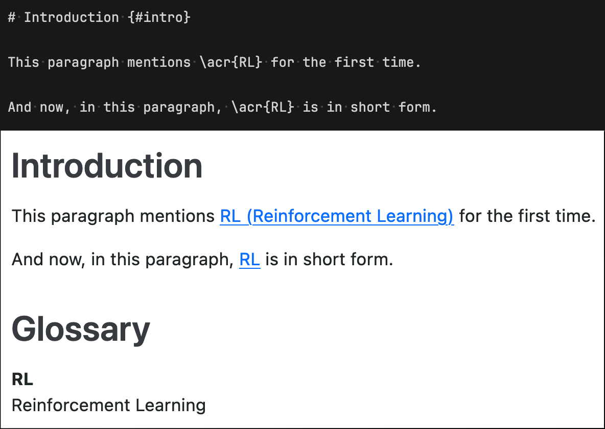

# Acronyms: List of Acronyms support for Quarto documents

> Author: rchaput <rchaput.pro@gmail.com>

[](LICENSE)
[](https://github.com/rchaput/acronyms/releases)
[](https://github.com/rchaput/acronyms/releases)
[](https://rchaput.github.io/acronyms)
[](https://github.com/rchaput/acronyms/actions/workflows/tests.yml)


## Description

This Quarto extension adds the ability to automatically handle acronyms
inside [Quarto][quarto] (qmd) documents.

Throughout the document, acronyms are replaced by either their short name,
or their long name, depending on whether they appear for the first time.
They also may be linked to their corresponding definition in an automatically
generated List of Acronyms, so that readers can access the definition in one 
click.

It is based on the previous [Acronymsdown][acronymsdown] package, which
provided the same features, but for [RMarkdown][rmarkdown] documents.




## Features

- Tired of manually having to check whether the first occurrence of an
  acronym is correctly explained to your readers? **acronyms**
  automatically replaces acronyms, based on whether they appear for the
  first time.
- Generate a List of Acronyms based on your defined acronyms.
  + The place where this list will be generated can be
    [specified](https://rchaput.github.io/acronyms/articles/options.html#insert_loa)
    (by default, at the beginning of the document).
- Automatic sorting of this list.
+ You can choose between the *alphabetical*, *usage* or *initial*
  [order](https://rchaput.github.io/acronyms/articles/options.html#sorting).
- Easily manage acronyms
  + Choose between multiple [styles](https://rchaput.github.io/acronyms/articles/styles.html)
    to replace acronyms.
  + By default, 1st occurrence is replaced by *long name (short name)*,
    and following occurrences are simply replaced by *short name*.
  + All occurrences can also be linked to the acronym's definition in
    the List of Acronyms.
- Define acronyms directly in your document or
  [in external files](https://rchaput.github.io/acronyms/articles/advanced_usage.html#defining-acronyms-in-external-files).
- Extensive configuration
  + Most of this package's mechanisms can be
    [configured](https://rchaput.github.io/acronyms/articles/options.html):
    how to handle duplicate keys, whether to raise an error, print a warning
    or ignore an non-existing key, how to sort, ...
  + Sane defaults are included, such that this package can be used
    out-of-the-box.


## Installation

In a terminal, in the same directory as your Quarto document (or project),
enter the following command:

```sh
quarto add rchaput/acronyms@master
```

This will automatically install the latest version from GitHub into your
`_extensions/` folder. (You may also specify a version tag instead of `master`;
see the list of [releases](https://github.com/rchaput/acronyms/releases)).
Then, in your Quarto document (or project configuration), add the following
lines to your YAML metadata:

```yaml
---
filters:
  - acronyms
---
```

If you already have a `filters:` block, simply add the `- acronyms` line at
the end of the list.


## Usage

Using this package requires 2 simple steps:

1. Define your acronyms in the YAML metadata.

```yaml
---
acronyms:
  keys:
    - shortname: qmd
      longname: Quarto documents
    - shortname: YAML
      longname: YAML Ain't Markup Language
---
```

2. Use your acronyms in your qmd document with the `\acr{<KEY>}` special command!

`\acr{qmd} can be used to write technical content. \acr{qmd} use \acr{YAML}.`

which renders as (using default options):

> Quarto documents can be used to write technical content. qmd use YAML Ain't Markup Language.


## Credits

This package was inspired from:

- an [issue on bookdown](https://github.com/rstudio/bookdown/issues/199) ;
- [a lua filter to sort a definition list](https://gist.github.com/RLesur/e81358c11031d06e40b8fef9fdfb2682) ;
- the [pagedown's insertion of a List of Figures/Tables](https://github.com/rstudio/pagedown/blob/main/inst/resources/lua/loft.lua) ;
- the [pandoc-abbreviations filter](https://github.com/dsanson/pandoc-abbreviations.lua/) ;
- the LaTeX [glossaries](https://www.ctan.org/pkg/glossaries) package.

[quarto]: https://quarto.org/
[acronymsdown]: https://github.com/rchaput/acronymsdown/
[rmarkdown]: https://rmarkdown.rstudio.com/
